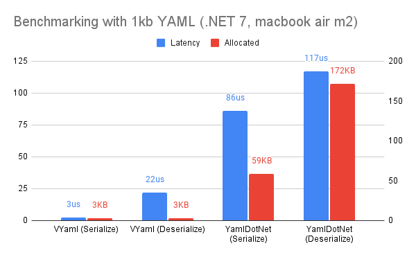
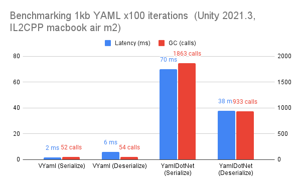

# VYaml

[](./LICENSE)

[](https://www.nuget.org/packages/VYaml)

VYaml is a pure C# YAML 1.2 implementation, which is extra fast, low memory footprint with focued on .NET and Unity.

- The parser is heavily influenced by [yaml-rust](https://github.com/chyh1990/yaml-rust), and libyaml, yaml-cpp.
- Serialization interface/implementation is heavily influenced by [Utf8Json](https://github.com/neuecc/Utf8Json), [MessagePack-CSharp](https://github.com/neuecc/MessagePack-CSharp), [MemoryPack](https://github.com/Cysharp/MemoryPack).

The reason VYaml is fast is it handles utf8 byte sequences directly with newface api set of C# (`System.Buffers.*`, etc).
In parsing, scalar values are pooled and no allocation occurs until `Scalar.ToString()`. This works with very low memory footprint and low performance overhead, in environments such as Unity.




Compared with [YamlDotNet](https://github.com/aaubry/YamlDotNet) (most popular yaml library in C#), basically 6x faster and about 1/50 heap allocations in some case.


## Features

- YAML Parser (Reader)
  - [YAML 1.2 mostly supported](#httpsyamlorgspec122)
  - Support Unity serialized weird YAML format
      - https://forum.unity.com/threads/scene-files-invalid-yaml.355653/
      - YAML automatically generated by Unity may contain the symbol `"stripped"` in the document start line. This is against the YAML specification, but VYaml supports this format.
- YAML Emitter (Writer)
  - Write primitive types.
  - Write plain scalar, double-quoted scalar, literal scalar.
  - Write block style sequence, flow style sequence, and block mapping.
- Deserialize / Serialize
  - Convert between YAML and C# user-defined types.
  - Convert between YAML and primitive collection via `dynamic` .
  - Support interface-typed and abstract class-typed objects.
  - Support anchor (`&`) and alias (`*`) in the YAML spec.
  - Support multiple yaml documents to C# collection.
  - Customization
    - Rename key
    - Ignore member
- Mainly focused on Unity
    - Only 2021.3 and higher (netstandard2.1 compatible)

## Most recent roadmap

- [ ] Support node tree representation

## Installation

### NuGet

You can install the following nuget package.
https://www.nuget.org/packages/VYaml

```bash
dotnet add package VYaml
```

### Unity

> [!IMPORTANT]
> Starting with version 1.0, VYaml is now via NuGetForUnity.
> If you are using an older version, please follow these instructions to reinstall.

> [!NOTE]
> Requirements: Unity 2021.3 or later.

1. Install NugetForUnity.
2. Open the NuGet window by going to NuGet > Manage NuGet Packages, search for the "VYaml" package, and install it.
3. (Optional) Installing Unity-specific extensions:
  - Open the Package Manager window by selecting Window > Package Manager, then click on [+] > Add package from git URL and enter the following URL:
  - ```
    https://github.com/hadashiA/VYaml.git?path=VYaml.Unity/Assets/VYaml#1.2.0
    ```

## Usage

### Serialize / Deserialize

Define a struct or class to be serialized and annotate it with the `[YamlObject]` attribute and the partial keyword.

```csharp
using VYaml.Annotations;

[YamlObject]
public partial class Sample
{
    // By default, public fields and properties are serializable.
    public string A; // public field
    public string B { get; set; } // public property
    public string C { get; private set; } // public property (private setter)
    public string D { get; init; } // public property (init-only setter)

    // use `[YamlIgnore]` to remove target of a public member
    [YamlIgnore]
    public int PublicProperty2 => PublicProperty + PublicField;
}
```

Why partial is necessary ?
- VYaml uses [SourceGenerator](https://learn.microsoft.com/en-us/dotnet/csharp/roslyn-sdk/source-generators-overview) for metaprogramming, which supports automatic generation of partial declarations, sets to private fields.

``` csharp
var utf8Yaml = YamlSerializer.Serialize(new Sample
{
    A = "hello",
    B = "foo",
    C = "bar",
    D = "hoge",
});
```


Result:

```yaml
a: hello
b: foo
c: bar
d: hoge
```

By default, The `Serialize<T>` method returns an utf8 byte array. 
This is because it is common for writes to files or any data stores to be stored as strings in utf8 format.


If you wish to receive the results in a C# string, do the following
Note that this has the overhead of conversion to utf16.

``` csharp
var yamlString = YamlSerializer.SerializeToString(...);
```

You can also convert yaml to C#.

```csharp
using var stream = File.OpenRead("/path/to/yaml");
var sample = await YamlSerializer.DeserializeAsync<Sample>(stream);

// Or 
// var yamlUtf8Bytes = System.Text.Encoding.UTF8.GetBytes("<yaml string....>");
// var sample = YamlSerializer.Deserialize<Sample>(yamlUtf8Bytes);
```

```csharp
sample.A // #=> "hello"
sample.B // #=> "foo"
sample.C // #=> "bar"
sample.D // #=> "hoge"
```

#### Built-in supported types

These types can be serialized by default:

- .NET primitives (`byte`, `int`, `bool`, `char`, `double`, etc.)
- Any enum (Currently, only simple string representation)
- `string`, `decimal`, `Half`, `BigInteger`, `Complex`
- `TimeSpan`, `DateTime`, `DateTimeOffset`
- `Guid`, `Uri`, `Version`, `Type`
- `byte[]` as base64 string
- `T[]`, `T[,]`, `T[,,]`, `T[,,]`, `BitArray`
- `Nullable<>`, `KeyValuePair<,>`, `Tuple<,...>`, `ValueTuple<,...>`
- `List<>`, `Stack<>`, `Queue<>`, `LinkedList<>`, `HashSet<>`, `SortedSet<>`,  `BlockingCollection<>`, `ConcurrentQueue<>`, `ConcurrentStack<>`, `ConcurrentBag<>`
- `Dictionary<,>`
- `IEnumerable<>`, `ICollection<>`, `IList<>`, `IReadOnlyCollection<>`, `IReadOnlyList<>`, `ISet<>`
- `IDictionary<,>`, `IReadOnlyDictionary<,>`

The following types of support are included in the package for Unity.

- `Color`, `Color32`
- `Vector2`, `Vector2Int`, `Vector3`, `Vector3Int`, `Vector4`, `Vector4Int`
- `Matrix4x4`
- `Quaternion`
- `Rect`, `RectInt`, `RectOffset`
- Addtionaly, If the `Unity.Mathmatics` package is installed, the following support is enabled:
  - `bool2`, `bool3`, `bool4`
  - `float2`, `float3`, `float4`
  - `double2`, `double3`, `double4`
  - `half2`, `half3`, `half4`
  - `int2`, `int3`, `int4` 
  - `uint2`, `uint3`, `uint4` 
  - `bool2x2`, `bool2x3`, `bool2x4`, `bool3x2`, `bool3x3`, `bool3x4`, `bool4x2`, `bool4x3`, `bool4x4`
  - `float2x2`, `float2x3`, `float2x4`, `float3x2`, `float3x3`, `float3x4`, `float4x2`, `float4x3`, `float4x4`
  - `double2x2`, `double2x3`, `double2x4`, `double3x2`, `double3x3`, `double3x4`, `double4x2`, `double4x3`, `double4x4`
  - `int2x2`, `int2x3`, `int2x4`, `int3x2`, `int3x3`, `int3x4`, `int4x2`, `int4x3`, `int4x4`
  - `uint2x2`, `uint2x3`, `uint2x4`, `uint3x2`, `uint3x3`, `uint3x4`, `uint4x2`, `uint4x3`, `uint4x4`
  - `quaternion`
  

- To enable it, do the following
1. Install the unity package.
    - See [Installation/Unity](#unity) section.
2. Add UnityResolver to YamlSeriarOptions.
    - ```cs
      YamlSerializer.DefaultOptions = new YamlSerializerOptions
      {
          Resolver = CompositeResolver.Create(new IYamlFormatterResolver[]
          {
              StandardResolver.Instance,
              UnityResolver.Instance,
          })
      };
      ```

#### Deserialize as `dynamic`

You can also deserialize into primitive `object` type implicitly.

``` csharp
var yaml = YamlSerializer.Deserialize<dynamic>(yamlUtf8Bytes);
```

```csharp
yaml["a"] // #=> "hello"
yaml["b"] // #=> "aaa"
yaml["c"] // #=> "hoge"
yaml["d"] // #=> "ddd"
```

#### Deserialize multiple documents


YAML allows for multiple data in one file by separating them with `---`. This is called a "Document".
If you want to load multiple documents, you can use `Yamlserializer.DeserializeMultipleDocuments<T>(...)`.

For example:

``` yaml
---
Time: 2001-11-23 15:01:42 -5
User: ed
Warning:
  This is an error message
  for the log file
---
Time: 2001-11-23 15:02:31 -5
User: ed
Warning:
  A slightly different error
  message.
---
Date: 2001-11-23 15:03:17 -5
User: ed
Fatal:
  Unknown variable "bar"
Stack:
- file: TopClass.py
  line: 23
  code: |
    x = MoreObject("345\n")
- file: MoreClass.py
  line: 58
  code: |-
    foo = bar
```

``` csharp
var documents = YamlSerializer.DeserializeMultipleDocuments<dynamic>(yaml);
```

```csharp
documents[0]["Warning"] // #=> "This is an error message for the log file"
documents[1]["Warning"] // #=> "A slightly different error message."
documents[2]["Fatal"]   // #=> "Unknown variable \"bar\""
```

#### Naming convention

:exclamation: By default, VYaml maps C# property names in lower camel case (e.g. `propertyName`) format to yaml keys.

If you want to customize this behaviour, `YamlSerializerOptions.NamingConvention` to set it.

```cs
var options = YamlSerializerOptions.Standard;
options.NamingConvention = NamingConvention.SnakeCase;

YamlSerializer.Serialize(new A { FooBar = 123 }, options); // #=> "{ foo_bar: 123 }"
```

List of possible values:
- NamingConvention.LowerCamelCase
  - Like `propertyName`
- NamingConvention.UpperCamelCase:
  - Like `PropertyName`
- NamingConvention.SnakeCase:
  - Like  `property_name`
- NamingConvention.KebabCase:
  - Like `property-name`


> [!TIP]
> If you specify an option other than the default `LowerCamelCase`, there will be a slight performance degradation at runtime.

You may specify NamingConvention for each type declaration by `[YamlObject]` attribute.
In this case, no performance degradation occurs.

```csharp
[YamlObject(NamingConvention.SnakeCase)]
public partial class Sample
{
    public int FooBar { get; init; }
}
```

This serialize as:

```yaml
foo_bar: 100
```

Also, you can change the key name each members with `[YamlMember("name")]`

```csharp
[YamlObject]
public partial class Sample
{
    [YamlMember("foo-bar-alias")]
    public int FooBar { get; init; }
}
```

This serialize as:

```yaml
foo-bar-alias: 100
```

#### Custom constructor

VYaml supports both parameterized and parameterless constructors. The selection of the constructor follows these rules.

- If there is `[YamlConstructor]`, use it.
- If there is no explicit constructor use a parameterless one.
- If there is one constructor use it.
- If there are multiple constructors, then the `[YamlConstructor]` attribute must be applied to the desired constructor (the generator will not automatically choose one), otherwise the generator will emit an error.

:note: If using a parameterized constructor, all parameter names must match corresponding member names (case-insensitive).

``` csharp
[YamlObject]
public partial class Person
{
    public int Age { get; } 
    public string Name { get; }

    // You can use a parameterized constructor - parameter names must match corresponding members name (case-insensitive)
    public Person(int age, string name)
    {
        Age = age;
        Name = name;
    }
}

[YamlObject]
public partial class Person
{
    public int Age { get; set; }
    public string Name { get; set; }
    
    public Person()
    {
        // ...
    }

    // If there are multiple constructors, then [YamlConstructor] should be used
    [YamlConstructor]
    public Person(int age, string name)
    {
        this.Age = age;
        this.Name = name;
    }
}


[YamlObject]
public partial class Person
{
    public int Age { get; } // from constructor
    public string Name { get; } // from constructor
    public string Profile { get; set; } // from setter

    // If all members of the construct are not taken as arguments, setters are used for the other members
    public Person(int age, string name)
    {
        this.Age = age;
        this.Name = name;
    }
}
```

#### Enum

By default, Enum is serialized in camelCase with a leading lowercase letter, as is the key name of the object. 
For example:

``` csharp
enum Foo
{
    Item1,
    Item2,
    Item3,
}
```

``` csharp
YamlSerializer.Serialize(Foo.Item1); // #=> "item1"
```

It respect `[EnumMember]`, and `[DataMember]`.


``` csharp
enum Foo
{
    [EnumMember(Value = "item1-alias")]
    Item1,
    
    [EnumMember(Value = "item2-alias")]
    Item2,
    
    [EnumMember(Value = "item3-alias")]
    Item3,
}
```

``` csharp
YamlSerializer.Serialize(Foo.Item1); // #=> "item1-alias"
```

And, naming covnention can also be specified by using the `[YamlMember]` attribute.


``` csharp
[YamlObject(NamingConvention.SnakeCase)]
enum Foo
{
    ItemOne,
    ItemTwo,
    ItemThree,
}
```

``` csharp
YamlSerializer.Serialize(Foo.ItemOne); // #=> "item_one"
```

#### Polymorphism (Union)

VYaml supports deserialize interface or abstract class objects for. In VYaml this feature is called Union. 
Only interfaces and abstracts classes are allowed to be annotated with `[YamlObjectUnion]` attributes. Unique union tags are required.

``` csharp
[YamlObject]
[YamlObjectUnion("!foo", typeof(FooClass))]
[YamlObjectUnion("!bar", typeof(BarClass))]
public partial interface IUnionSample
{
}

[YamlObject]
public partial class FooClass : IUnionSample
{
    public int A { get; set; }
}

[YamlObject]
public partial class BarClass : IUnionSample
{
    public string? B { get; set; }
}
```

``` csharp
// We can deserialize as interface type.
var obj = YamlSerializer.Deserialize<IUnionSample>(UTF8.GetBytes("!foo { a: 100 }"));

obj.GetType(); // #=> FooClass
```

In the abobe example, The `!foo` and `!bar`  are called tag in the YAML specification.
YAML can mark arbitrary data in this way, and VYaml Union takes advantage of this.

You can also serialize:

``` csharp
YamlSerializer.Serialize<IUnionSample>(new FooClass { A = 100 });
```

Result:
``` yaml
!foo
a: 100
```

## Customize serialization behaviour

- `IYamlFormatter<T>` is an interface customize the serialization behaviour of a your particular type.
- `IYamlFormatterResolver` is an interface can customize how it searches for `IYamlFormatter<T>` at runtime.

To perform Serialize/Deserialize, it need an `IYamlFormatter<T>` corresponding to a certain C# type.  
By default, the following `StandardResolver` works and identifies IYamlFormatter<T>.


You can customize this behavior as follows:

``` csharp
var options = new YamlSerializerOptions
{
    Resolver = CompositeResolver.Create(
        new IYamlFormatter[]
        {
            new YourCustomFormatter1(), // You can add additional formatter
        },
        new IYamlFormatterResolver[]
        {
            new YourCustomResolver(),  // You can add additional resolver
            StandardResolver.Instance, // Fallback to default behavior at the end.
        })
};
        
YamlSerializer.Deserialize<T>(yaml, options);
YamlSerializer.Deserialize<T>(yaml, options);
```


## Low-Level API

### Parser

`YamlParser` struct provides access to the complete meta-information of yaml.


- `YamlParser.Read()` reads through to the next syntax on yaml. (If end of stream then return false.)
- `YamlParser.ParseEventType` indicates the state of the currently read yaml parsing result.
- How to access scalar value:
    - `YamlParser.GetScalarAs*` families take the result of converting a scalar at the current position to a specified type.
    - `YamlParser.TryGetScalarAs*` families return true and take a result if the current position is a scalar and of the specified type.
    - `YamlParser.ReadScalarAs*` families is similar to GetScalarAs*, but advances the present position to after the scalar read.
- How to access meta information:
    - `YamlParser.TryGetCurrentTag(out Tag tag)` 
    - `YamlParser.TryGetCurrentAnchor(out Anchor anchor)`

Basic example:

```csharp
var parser = YamlParser.FromBytes(utf8Bytes);

// YAML contains more than one `Document`. 
// Here we skip to before first document content.
parser.SkipAfter(ParseEventType.DocumentStart);

// Scanning...
while (parser.Read())
{
    // If the current syntax is Scalar, 
    if (parser.CurrentEventType == ParseEventType.Scalar)
    {
        var intValue = parser.GetScalarAsInt32();
        var stringValue = parser.GetScalarAsString();
        // ...
        
        if (parser.TryGetCurrentTag(out var tag))
        {
            // Check for the tag...
        }
        
        if (parser.TryGetCurrentAnchor(out var anchor))
        {
            // Check for the anchor...
        }        
    }
    
    // If the current syntax is Sequence (Like a list in yaml)
    else if (parser.CurrentEventType == ParseEventType.SequenceStart)
    {
        // We can check for the tag...
        // We can check for the anchor...
        
        parser.Read(); // Skip SequenceStart

        // Read to end of sequence
        while (!parser.End && parser.CurrentEventType != ParseEventType.SequenceEnd)
        {
             // A sequence element may be a scalar or other...
             if (parser.CurrentEventType == ParseEventType.Scalar)
             {
                 // ...
             }
             // ...
             // ...
             else
             {
                 // We can skip current element. (It could be a scalar, or alias, sequence, mapping...)
                 parser.SkipCurrentNode();
             }
        }
        parser.Read(); // Skip SequenceEnd.
    }
    
    // If the current syntax is Mapping (like a Dictionary in yaml)
    else if (parser.CurrentEventType == ParseEventType.MappingStart)
    {
        // We can check for the tag...
        // We can check for the anchor...
        
        parser.Read(); // Skip MappingStart

        // Read to end of mapping
        while (parser.CurrentEventType != ParseEventType.MappingEnd)
        {
             // After Mapping start, key and value appear alternately.
             
             var key = parser.ReadScalarAsString();  // if key is scalar
             var value = parser.ReadScalarAsString(); // if value is scalar
             
             // Or we can skip current key/value. (It could be a scalar, or alias, sequence, mapping...)
             // parser.SkipCurrentNode(); // skip key
             // parser.SkipCurrentNode(); // skip value
        }
        parser.Read(); // Skip MappingEnd.
    }
    
    // Alias
    else if (parser.CurrentEventType == ParseEventType.Alias)
    {
        // If Alias is used, the previous anchors must be holded somewhere.
        // In the High level Deserialize API, `YamlDeserializationContext` does exactly this. 
    }
}
```

See [test code](https://github.com/hadashiA/VYaml/blob/master/VYaml.Tests/Parser/SpecTest.cs) for more information.
The above test covers various patterns for the order of `ParsingEvent`.


### Emitter

`Utf8YamlEmitter` struct provides to write YAML formatted string.

Basic usage:

``` csharp
var buffer = new ArrayBufferWriter<byte>();
var emitter = new Utf8YamlEmitter(buffer); // It needs buffer implemented `IBufferWriter<byte>`

emitter.BeginMapping(); // Mapping is a collection like Dictionary in YAML
{
    emitter.WriteString("key1");
    emitter.WriteString("value-1");
    
    emitter.WriteString("key2");
    emitter.WriteInt32(222);
    
    emitter.WriteString("key3");
    emitter.WriteFloat(3.333f);
}
emitter.EndMapping();
```

``` csharp
// If you want to expand a string in memory, you can do this.
System.Text.Encoding.UTF8.GetString(buffer.WrittenSpan); 
```

``` yaml
key1: value-1
key2: 222
key3: 3.333
```

#### Emit string in various formats

By default, WriteString() automatically determines the format of a scalar. 


Multi-line strings are automatically format as a literal scalar:

``` csharp
emitter.WriteString("Hello,\nWorld!\n");
```

``` yaml
|
  Hello,
  World!
```

Special characters contained strings are automatically quoted.

``` csharp
emitter.WriteString("&aaaaa ");
```

``` yaml
"&aaaaa "
```

Or you can specify the style explicitly:

``` csharp
emitter.WriteString("aaaaaaa", ScalarStyle.Literal);
```

``` yaml
|-
  aaaaaaaa
```

#### Emit sequences and other structures

e.g:

``` csharp
emitter.BeginSequence();
{
    emitter.BeginSequence(SequenceStyle.Flow);
    {
        emitter.WriteInt32(100);
        emitter.WriteString("&hoge");
        emitter.WriteString("bra");
    }
    emitter.EndSequence();
    
    emitter.BeginMapping();
    {
        emitter.WriteString("key1");
        emitter.WriteString("item1");
        
        emitter.WriteString("key2");
        emitter.BeginSequence();
        {
            emitter.WriteString("nested-item1")
            emitter.WriteString("nested-item2")
            emitter.BeginMapping();
            {
                emitter.WriteString("nested-key1")
                emitter.WriteInt32(100)
            }
            emitter.EndMapping();
        }
        emitter.EndSequence();
    }
    emitter.EndMapping();
}
emitter.EndMapping();
```

``` yaml
- [100, "&hoge", bra]
- key1: item1
  key2:
  - nested-item1
  - nested-item2
  - nested-key1: 100
```
    
## YAML 1.2 spec support status

### Implicit primitive type conversion of scalar

The following is the default implicit type interpretation.

Basically, it follows YAML Core Schema.
https://yaml.org/spec/1.2.2/#103-core-schema

|Support|Regular expression|Resolved to type|
|:-----|:-------|:-------|
| :white_check_mark: | `null \| Null \| NULL \| ~` | null |
| :white_check_mark: | `/* Empty */` | null |
| :white_check_mark: | `true \| True \| TRUE \| false \| False \| FALSE` | boolean |
| :white_check_mark: | `[-+]? [0-9]+` | int  (Base 10) |
| :white_check_mark: | `0o [0-7]+` | int (Base 8) |
| :white_check_mark: | `0x [0-9a-fA-F]+` | int (Base 16) |
| :white_check_mark: | `[-+]? ( \. [0-9]+ \| [0-9]+ ( \. [0-9]* )? ) ( [eE] [-+]? [0-9]+ )?` | float |
| :white_check_mark: | `[-+]? ( \.inf \| \.Inf \| \.INF )` | float (Infinity) |
| :white_check_mark: | `\.nan \| \.NaN \| \.NAN` | float (Not a number) |

### https://yaml.org/spec/1.2.2/

Following is the results of the [test](https://github.com/hadashiA/VYaml/blob/master/VYaml.Tests/Parser/SpecTest.cs) for the examples from the  [yaml spec page](https://yaml.org/spec/1.2.2/).

- 2.1. Collections
  - :white_check_mark: Example 2.1 Sequence of Scalars (ball players)
  - :white_check_mark: Example 2.2 Mapping Scalars to Scalars (player statistics)
  - :white_check_mark: Example 2.3 Mapping Scalars to Sequences (ball clubs in each league)
  - :white_check_mark: Example 2.4 Sequence of Mappings (players statistics)
  - :white_check_mark: Example 2.5 Sequence of Sequences
  - :white_check_mark: Example 2.6 Mapping of Mappings
- 2.2. Structures
  - :white_check_mark: Example 2.7 Two Documents in a Stream (each with a leading comment)
  - :white_check_mark: Example 2.8 Play by Play Feed from a Game
  - :white_check_mark: Example 2.9 Single Document with Two Comments
  - :white_check_mark: Example 2.10 Node for Sammy Sosa appears twice in this document
  - :white_check_mark: Example 2.11 Mapping between Sequences
  - :white_check_mark: Example 2.12 Compact Nested Mapping
- 2.3. Scalars
  - :white_check_mark: Example 2.13 In literals, newlines are preserved
  - :white_check_mark: Example 2.14 In the folded scalars, newlines become spaces
  - :white_check_mark: Example 2.15 Folded newlines are preserved for more indented and blank lines
  - :white_check_mark: Example 2.16 Indentation determines scope
  - :white_check_mark: Example 2.17 Quoted Scalars
  - :white_check_mark: Example 2.18 Multi-line Flow Scalars
- 2.4. Tags
  - :white_check_mark: Example 2.19 Integers
  - :white_check_mark: Example 2.20 Floating Point
  - :white_check_mark: Example 2.21 Miscellaneous
  - :white_check_mark: Example 2.22 Timestamps
  - :white_check_mark: Example 2.23 Various Explicit Tags
  - :white_check_mark: Example 2.24 Global Tags
  - :white_check_mark: Example 2.25 Unordered Sets
  - :white_check_mark: Example 2.26 Ordered Mappings
- 2.5. Full Length Example
  - :white_check_mark: Example 2.27 Invoice
  - :white_check_mark: Example 2.28 Log File
- 5.2. Character Encodings
  - :white_check_mark: Example 5.1 Byte Order Mark
  - :white_check_mark: Example 5.2 Invalid Byte Order Mark
- 5.3. Indicator Characters
  - :white_check_mark: Example 5.3 Block Structure Indicators
  - :white_check_mark: Example 5.4 Flow Collection Indicators
  - :white_check_mark: Example 5.5 Comment Indicator
  - :white_check_mark: Example 5.6 Node Property Indicators
  - :white_check_mark: Example 5.7 Block Scalar Indicators
  - :white_check_mark: Example 5.8 Quoted Scalar Indicators
  - :white_check_mark: Example 5.9 Directive Indicator
  - :white_check_mark: Example 5.10 Invalid use of Reserved Indicators
- 5.4. Line Break Characters
  - :white_check_mark: Example 5.11 Line Break Characters
  - :white_check_mark: Example 5.12 Tabs and Spaces
  - :white_check_mark: Example 5.13 Escaped Characters
  - :white_check_mark: Example 5.14 Invalid Escaped Characters
- 6.1. Indentation Spaces
  - :white_check_mark: Example 6.1 Indentation Spaces
  - :white_check_mark: Example 6.2 Indentation Indicators
- 6.2. Separation Spaces
  - :white_check_mark: Example 6.3 Separation Spaces
- 6.3. Line Prefixes
  - :white_check_mark: Example 6.4 Line Prefixes
- 6.4. Empty Lines
  - :white_check_mark: Example 6.5 Empty Lines
- 6.5. Line Folding
  - :white_check_mark: Example 6.6 Line Folding
  - :white_check_mark: Example 6.7 Block Folding
  - :white_check_mark: Example 6.8 Flow Folding
- 6.6. Comments
  - :white_check_mark: Example 6.9 Separated Comment
  - :white_check_mark: Example 6.10 Comment Lines
  - :white_check_mark: Example 6.11 Multi-Line Comments
- 6.7. Separation Lines
  - :white_check_mark: Example 6.12 Separation Spaces
- 6.8. Directives
  - :white_check_mark: Example 6.13 Reserved Directives
  - :white_check_mark: Example 6.14 YAML directive
  - :white_check_mark: Example 6.15 Invalid Repeated YAML directive
  - :white_check_mark: Example 6.16 TAG directive
  - :white_check_mark: Example 6.17 Invalid Repeated TAG directive
  - :white_check_mark: Example 6.18 Primary Tag Handle
  - :white_check_mark: Example 6.19 Secondary Tag Handle
  - :white_check_mark: Example 6.20 Tag Handles
  - :white_check_mark: Example 6.21 Local Tag Prefix
  - :white_check_mark: Example 6.22 Global Tag Prefix
- 6.9. Node Properties
  - :white_check_mark: Example 6.23 Node Properties
  - :white_check_mark: Example 6.24 Verbatim Tags
  - :white_check_mark: Example 6.25 Invalid Verbatim Tags
  - :white_check_mark: Example 6.26 Tag Shorthands
  - :white_check_mark: Example 6.27 Invalid Tag Shorthands
  - :white_check_mark: Example 6.28 Non-Specific Tags
  - :white_check_mark: Example 6.29 Node Anchors
- 7.1. Alias Nodes
  - :white_check_mark: Example 7.1 Alias Nodes
- 7.2. Empty Nodes
  - :white_check_mark: Example 7.2 Empty Content
  - :white_check_mark: Example 7.3 Completely Empty Flow Nodes
- 7.3. Flow Scalar Styles
  - :white_check_mark: Example 7.4 Double Quoted Implicit Keys
  - :white_check_mark: Example 7.5 Double Quoted Line Breaks
  - :white_check_mark: Example 7.6 Double Quoted Lines
  - :white_check_mark: Example 7.7 Single Quoted Characters
  - :white_check_mark: Example 7.8 Single Quoted Implicit Keys
  - :white_check_mark: Example 7.9 Single Quoted Lines
  - :white_check_mark: Example 7.10 Plain Characters
  - :white_check_mark: Example 7.11 Plain Implicit Keys
  - :white_check_mark: Example 7.12 Plain Lines
- 7.4. Flow Collection Styles
  - :white_check_mark: Example 7.13 Flow Sequence
  - :white_check_mark: Example 7.14 Flow Sequence Entries
  - :white_check_mark: Example 7.15 Flow Mappings
  - :white_check_mark: Example 7.16 Flow Mapping Entries
  - :white_check_mark: Example 7.17 Flow Mapping Separate Values
  - :white_check_mark: Example 7.18 Flow Mapping Adjacent Values
  - :white_check_mark: Example 7.20 Single Pair Explicit Entry
  - :x: Example 7.21 Single Pair Implicit Entries
  - :white_check_mark: Example 7.22 Invalid Implicit Keys
  - :white_check_mark: Example 7.23 Flow Content
  - :white_check_mark: Example 7.24 Flow Nodes
- 8.1. Block Scalar Styles
  - :white_check_mark: Example 8.1 Block Scalar Header
  - :x: Example 8.2 Block Indentation Indicator
  - :white_check_mark: Example 8.3 Invalid Block Scalar Indentation Indicators
  - :white_check_mark: Example 8.4 Chomping Final Line Break
  - :white_check_mark: Example 8.5 Chomping Trailing Lines
  - :white_check_mark: Example 8.6 Empty Scalar Chomping
  - :white_check_mark: Example 8.7 Literal Scalar
  - :white_check_mark: Example 8.8 Literal Content
  - :white_check_mark: Example 8.9 Folded Scalar
  - :white_check_mark: Example 8.10 Folded Lines
  - :white_check_mark: Example 8.11 More Indented Lines
  - :white_check_mark: Example 8.12 Empty Separation Lines
  - :white_check_mark: Example 8.13 Final Empty Lines
  - :white_check_mark: Example 8.14 Block Sequence
  - :white_check_mark: Example 8.15 Block Sequence Entry Types
  - :white_check_mark: Example 8.16 Block Mappings
  - :white_check_mark: Example 8.17 Explicit Block Mapping Entries
  - :white_check_mark: Example 8.18 Implicit Block Mapping Entries
  - :white_check_mark: Example 8.19 Compact Block Mappings
  - :white_check_mark: Example 8.20 Block Node Types
  - :white_check_mark: Example 8.21 Block Scalar Nodes
  - :white_check_mark: Example 8.22 Block Collection Nodes

## Credits

VYaml is inspired by:

- [yaml-rust](https://github.com/chyh1990/yaml-rust)
- [Utf8Json](https://github.com/neuecc/Utf8Json), [MessagePack-CSharp](https://github.com/neuecc/MessagePack-CSharp), [MemoryPack](https://github.com/Cysharp/MemoryPack)

## Aurhor

[@hadashiA](https://github.com/hadashiA)

## License

MIT

